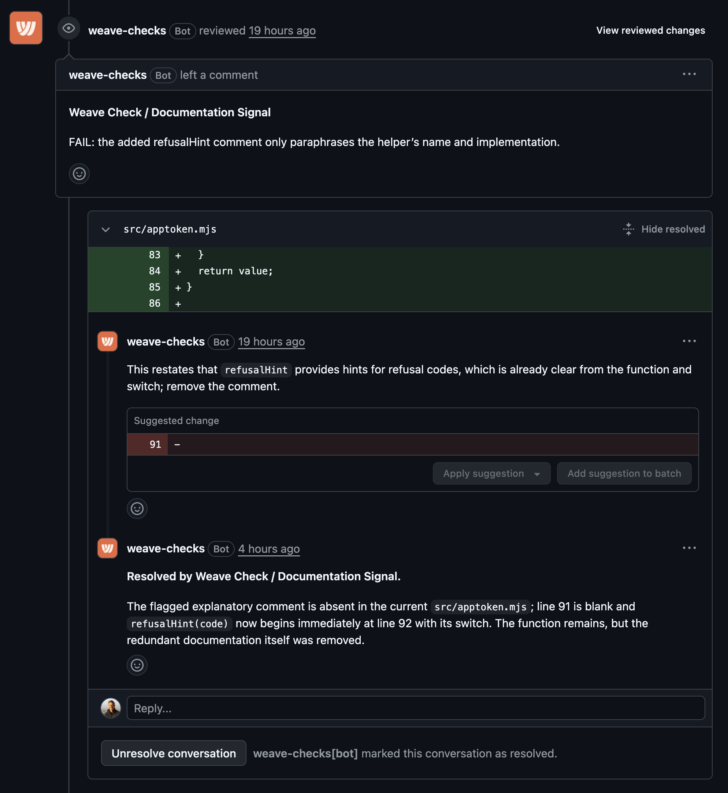

# Weave Checks

[](https://app.weaveos.com/reports/repository/org_QWsHDcRQWQEs6RpkdEZrlFK8/https%3A%2F%2Fgithub.com/1393877603)

[](https://github.com/weave-os/checks/actions/workflows/test.yml)

Software factories have a QA problem. Weave Checks helps your factory output higher quality software, by letting you enforce the principles you care about (without a human reading every line).

Historically, code was reviewed by humans. Two of the most important goals of human reviews typically were:

1. Finding bugs
2. Keeping code quality consistent by communicating the standards of the codebase

AI makes human code reviews unscalable. A software factory cannot rely on a human validating every diff. So we need to replace #1 and #2 somehow.

AI reviewers (e.g. Greptile, Cursor BugBot, CodeRabbit, Cubic, etc.) solve half of the problem: they're very good at #1. But they do not do #2 at all.

Weave Checks is designed to solve #2, with the same scalability as AI bug reviewers.

Weave Checks works best when powered by the [Weave Router](https://weaveos.com/router) - it costs 10x less with identical performance. [See the full breakdown below](#cost).

## Getting started

To set up Weave Checks for your own repository:

1. [Install the Weave Checks app](https://github.com/apps/weave-checks/installations/new)
1. [Create a Weave Router key](https://router.weaveos.com/build), copy it to your clipboard
1. Add the key as a repository secret called `WEAVE_ROUTER_KEY` (Settings -> Secrets and variables -> Actions -> New repository secret)
   - If you're setting up across >1 repo at once, we recommend using an Organization secret instead
1. Add the workflow to your repo by running this from your repo root:

   ```sh
   mkdir -p .github/workflows && curl -fsSL https://raw.githubusercontent.com/weave-os/checks/main/examples/weave-checks.yml -o .github/workflows/weave-checks.yml
   ```

1. Commit & push the change. Now the [starter checks](./starter-checks/) will run in your repository
1. **Write your own checks**. You can add them to the `.weave-checks` directory in your repo root.

The last step is both the hardest and the most important. **Do not have an agent do it for you**. You need to think about what you care about and encode it in these checks.

A couple useful starting points:

- Have an agent look at human review comments over the last month and pull trends. What types of stuff are AI reviewers missing?
- Check out our [library](./checks-library/) of useful checks

## Cost

Checks run every time new code is pushed. If you use Anthropic models directly (even Haiku!) this can get quite expensive.

For reference: running the [starter checks](./starter-checks/) on [this example commit](https://github.com/weave-os/checks/commit/131cc9b0318eaa7378b175581569b16f145baef3) costs **$1.07** and takes **7m 29s**. Assuming every engineer on your team pushes 20 commits of a similar size every day, that adds up to **$428/engineer/month**.

Luckily there's a better way: the **[Weave Router](https://weaveos.com/router)** uses the best model for the session automatically, and can use open-source models to get significantly better cost performance & speed, at the same quality. For that same commit, running the starter checks with the Weave Router costs **$0.10** and takes **4m 59s**. That adds up to a much more manageable **$40/engineer/month**.

| Provider     | Cost      | Time       | Monthly Cost per Engineer<sup>1</sup> |
| ------------ | --------- | ---------- | ------------------------------------- |
| Anthropic    | $1.07     | 7m 29s     | $428                                  |
| Weave Router | **$0.10** | **4m 59s** | **$40**                               |

<sup>1</sup> Assumes 20 similar-sized commits per engineer per day.

## How it works

Each **Weave Check** is a single markdown file. Here's a minimal example:

```md
---
name: Documentation Signal
description: Flags documentation that repeats code without preserving a non-obvious contract or rationale
intelligence: low
---

Review changed comments and documentation for text that adds no information beyond the adjacent code or signature.
```

The markdown file is passed to an agent, along with the context of the code changed. The agent can either pass the diff (if it does not violate the check) or fail it, in which case it will post comments explaining the failure.

When you push code that resolves a reported bug, the comment thread will auto resolve.

Here's an [example](https://github.com/weave-os/checks/pull/1#pullrequestreview-5348408708) of a check firing + self-resolving:



**This repository does not define what good code looks like**. It just provides the machinery to enforce your own definition. The fun and useful part is writing your own checks!

With that said, we do provide a set of [starter checks](./starter-checks/) which you can opt into. These are battle-tested from our own usage at [Weave](https://weaveos.com) since July 2026. We believe they apply to any codebase. In particular they help get rid of the most common kinds of AI slop that most coding agents love to introduce.

We also provide a [checks library](./checks-library/) for checks that might not apply to every codebase but are quite useful where they do apply. We welcome contributions to this library!

## Running checks locally

This repository also contains the source for the `@weave-os/checks` CLI. Once you have checks in your repo, you can run them locally:

```sh
npx @weave-os/checks run
```

## Acknowledgment

> The generic starter-check corpus and per-concern review format adapt material and design from [Continue Checks](https://github.com/continuedev/checks), Copyright 2025 Continue Dev, Inc., Apache-2.0. See [`NOTICE`](NOTICE) for attribution and [`LICENSE`](LICENSE) for this package's license.

## Documentation

### Weave Check Markdown file format

Put one Markdown file per check in the `.weave-checks` directory of your repository.

The Markdown file defining a check must have frontmatter with the following metadata:

- `name`: human-friendly name for the check.
- `description`: explains what the check is for in one sentence.
- `intelligence`: one of `low`, `medium`, `high`, or `maximum`. This is a cost optimization lever. Warning: any check that uses `high` or `maximum` will be extremely expensive over time if you run it on every single commit!

After the frontmatter there is no required structure. However, we would recommend including a couple sections in your file to help the agent:

- When to check
- What to look for
- What not to look for

Examples can also be very helpful.

Check filenames (without `.md`) must contain only lowercase ASCII letters, digits, and hyphens; the filename becomes the check slug and comment-history marker. A `README.md` in the checks directory is treated as documentation by default. Set `doc-files` to customize this list.

Add a `.ignore` file beside the checks to exclude repository-relative git pathspecs from every review diff, for example:

```text
# Large generated output
vendor
build/generated/*.go
```

Blank lines and `#` comments are ignored. Unsafe patterns that can exclude the whole repository or escape its root fail discovery rather than silently disabling review.

The generic checks in [`starter-checks/`](starter-checks/) are available as optional defaults. Set `use-default-checks: true` to run them alongside any checks in your configured `checks-dir`; without that setting, only your directory is used. The additional checks in [`checks-library/`](checks-library/) target concerns that may make sense for some repositories but are not universal defaults; see its README before adopting any. Checks are distributed under this package's Apache-2.0 license; see [`NOTICE`](NOTICE) for attribution.

### GitHub workflow

Here is a minimal file that will run Weave Checks, which you can place in your repository's `.github/workflows` directory:

```yml
# yaml-language-server: $schema=https://json.schemastore.org/github-workflow.json
name: Weave Checks

on:
  pull_request:
    types: [opened, synchronize, reopened]

jobs:
  weave-checks:
    uses: weave-os/checks/.github/workflows/weave-checks.yml@v1.0
    permissions:
      id-token: write
    with:
      use-default-checks: true
    secrets:
      weave-router-key: ${{ secrets.WEAVE_ROUTER_KEY }}
```

Use a published version tag such as `v1.0`, not a moving branch like `main`. The signed OIDC token identifies the resolved workflow commit (`job_workflow_sha`), and the workflow runs the action from that same commit.

#### Provider setup

The workflow defaults to `provider: weave-router`, as in the example above. Set a repository or organization secret named `WEAVE_ROUTER_KEY` and pass it as `weave-router-key`.

The production Router URL is used by default. For a self-hosted Router, set the workflow's `weave-router-url` input to its host URL (for example, `${{ vars.WEAVE_ROUTER_URL }}`).

With `provider: anthropic`, pass an Anthropic API key, Claude Code OAuth credentials, or an Anthropic-compatible endpoint through the `provider-env` secret. The Router key is not needed. Example for a gateway, with a repository secret `WEAVE_CHECKS_PROVIDER_ENV` holding the lines to pass:

```yaml
with:
  provider: anthropic
secrets:
  provider-env: ${{ secrets.WEAVE_CHECKS_PROVIDER_ENV }}
```

```text
ANTHROPIC_BASE_URL=https://llm-gateway.example.com
ANTHROPIC_CUSTOM_HEADERS=X-Workspace: code-review
```

`provider-env` is a secret because it usually carries credentials; its values are set only on the agent process. Other examples include `ANTHROPIC_CUSTOM_HEADERS`, `CLAUDE_CODE_USE_BEDROCK=1`, and `CLAUDE_CODE_USE_VERTEX=1`. For Bedrock/Vertex, configure the relevant cloud identity/region in the job as appropriate.

#### Inputs

| Input                 | Default         | Purpose                                                                                                  |
| --------------------- | --------------- | -------------------------------------------------------------------------------------------------------- |
| `provider`            | `weave-router`  | `weave-router`, or `anthropic` (direct or any Anthropic-compatible endpoint).                            |
| `weave-router-url`    | production URL  | Router host URL for `weave-router`; defaults to `https://router.weaveos.com`.                            |
| `checks-dir`          | `.weave-checks` | Check definitions, relative to the repo root.                                                            |
| `use-default-checks`  | `false`         | Also run this package's starter checks alongside `checks-dir`.                                           |
| `doc-files`           | `README.md`     | Comma-separated Markdown files in `checks-dir` that are documentation, not checks.                       |
| `diff-base`           | `incremental`   | Incremental review after verifying a fully-reviewed ancestor, or `merge-base` for the full PR every run. |
| `concurrency`         | `16`            | Checks run at once.                                                                                      |
| `claude-code-version` | `latest`        | `@anthropic-ai/claude-code` version; pin it for reproducible reviews.                                    |
| `fail-on-findings`    | `false`         | Fail the job on findings, without changing check-run conclusions.                                        |
| `upload-diagnostics`  | `false`         | Upload prompts and transcripts as a workflow artifact.                                                   |
| `runs-on`             | `ubuntu-latest` | Runner label for the job.                                                                                |
| `timeout-minutes`     | `30`            | Job timeout.                                                                                             |

#### Secrets

| Secret                                          | Purpose                                                                         |
| ----------------------------------------------- | ------------------------------------------------------------------------------- |
| `weave-router-key`                              | Router key used for requests and session-cost lookups, only for Router mode.    |
| `anthropic-api-key` / `claude-code-oauth-token` | Anthropic credentials; provide one if the selected endpoint needs them.         |
| `provider-env`                                  | Extra `KEY=VALUE` environment for Anthropic-compatible providers, one per line. |

#### Outputs

`pass`, `flagged`, `neutral`, and `total-cost`. Result counts distinguish findings (`flagged`) from non-failing outcomes (`neutral`), including unusable model output; each neutral check result includes a `cause` of `infrastructure` or `invalid_output`. The aggregate check fails only for infrastructure errors. `total-cost` is empty when any contributing cost is unknown. Reviews are posted inline as `COMMENT` reviews; resolution and deduplication judges always run when they have work. These behaviors are fixed, not configurable. There are no per-invocation cost ceilings.

### Local CLI

Run the checks against the current working tree without GitHub access:

```sh
npx @weave-os/checks list --checks-dir .weave-checks
npx @weave-os/checks run --checks-dir .weave-checks --base origin/main
```

`run` reviews staged, unstaged, and untracked changes (but not gitignored files) relative to the merge base with `--base`, by default `origin/main` or `main` if no `origin/main` exists. Use `--head <ref>` to review a committed range instead. The local runner defaults to `provider: inherit`, loading the current user's Claude Code configuration; select `anthropic` or `weave-router` explicitly for a different provider. Router mode reads `WEAVE_ROUTER_KEY` from the environment; `WEAVE_ROUTER_URL` optionally overrides the default production host. The same router key authenticates the session-cost endpoint. Example:

```sh
export WEAVE_ROUTER_KEY="rk_..."
# Optional override for a self-hosted or staging Router:
# export WEAVE_ROUTER_URL="https://<your-router-host>"
npx @weave-os/checks run --provider weave-router --checks-dir .weave-checks --base origin/main
```

For an Anthropic-compatible gateway, for example:

```sh
WEAVE_CHECKS_PROVIDER_ENV='ANTHROPIC_BASE_URL=https://llm-gateway.example.com' \
npx @weave-os/checks run --provider anthropic --checks-dir .weave-checks --base origin/main --format markdown
```

`run` exits 1 when at least one check flags findings, 2 for invalid options or setup, and 0 when there are no findings. Use `--no-fail` to report findings without a non-zero exit. Neutral outcomes do not fail the run. `--format` supports `text`, `markdown`, and `json`; `--output <file>` writes the JSON result as well. Prompts, transcripts, and per-check results are stored in a temporary directory by default; `--artifacts-dir` keeps them at the path you choose. These artifacts contain the diff and agent output, so handle them as repository data.

`list --format json` prints the validated matrix. `print-schema` prints the result schema; `print-schema --kind resolution` and `--kind dedup` print the judge schemas.

## Security

### Permissions

The App needs Checks and Pull requests write access for check runs and reviews, plus Contents write so it can resolve review threads. GitHub gates `resolveReviewThread` behind Contents write even though it changes no repository files.

The action uses a repository-scoped installation token and never asks the agent to use it nor provides it to the agent, but the token itself has permission to write repository contents.

Tool permissions are read-only for the agent. The action and Claude Code CLI still process untrusted pull-request content; nothing in the job executes pull-request code or checks out the PR head before minting the App token.

### App authentication

At the start of the job, the app requests a GitHub OIDC token with the audience `weave-checks`. That token is GitHub's signed statement of which repository is running, and which reusable workflow at which commit (`job_workflow_ref` and `job_workflow_sha`). The workflow runs the action from that same commit, so the code Weave approves is the code that runs. The action sends the token to Weave, which checks it and returns a Weave Checks App installation token. Weave takes the repository from the OIDC token's signed claims, not from anything in the request. The returned token is scoped to that one repository with the App's review permissions, and it expires within an hour. The action uses it for every GitHub call and revokes it when the job finishes. It is never a workflow output.

The job needs nothing but `id-token: write`; every GitHub call it makes is as the Weave Checks App. Pull requests from forks get no OIDC token, so the workflow skips them. It runs on `pull_request` events only; never call it from `pull_request_target`.

If authentication fails, the job stops before creating any check run, with one of these explanations:

- `id-token: write` is missing from the calling job.
- The workflow commit is not approved for `weave-os/checks/.github/workflows/weave-checks.yml`, or the action was run directly as a step. Use a published version tag such as `v1.0`.
- The App is not installed on the repository's owner, or not on this repository. Add it from the App's installation settings.

## License

Apache-2.0. See [`LICENSE`](LICENSE) and [`NOTICE`](NOTICE).
